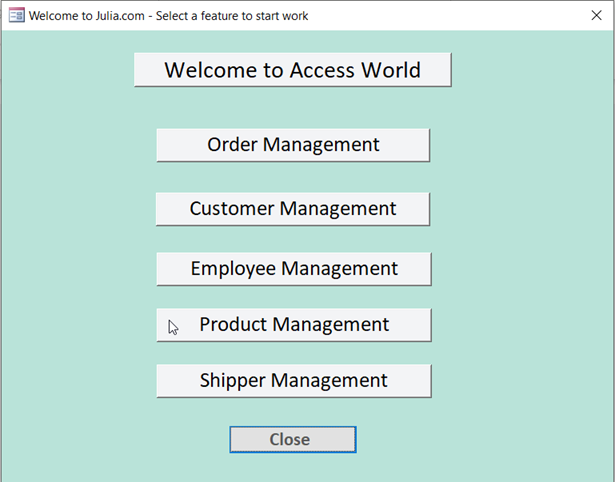
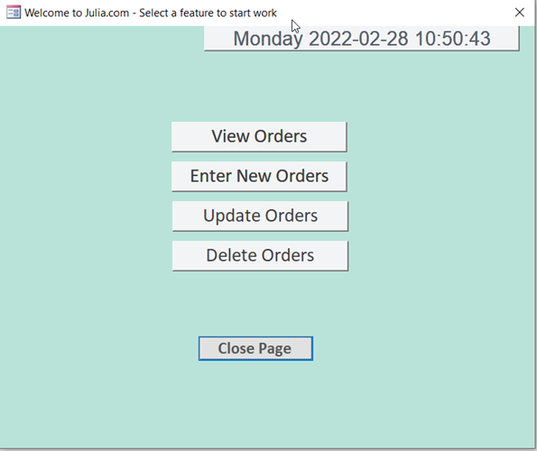
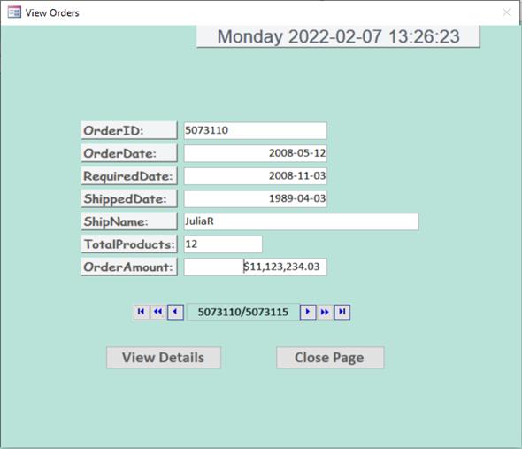
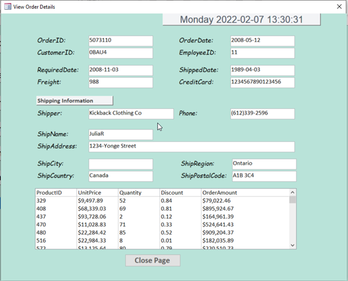
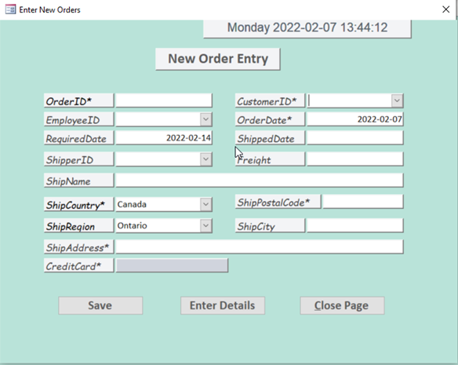
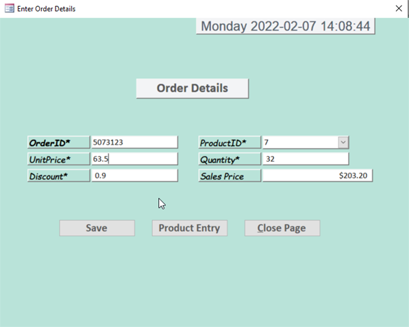
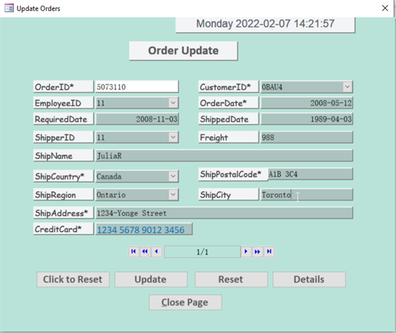
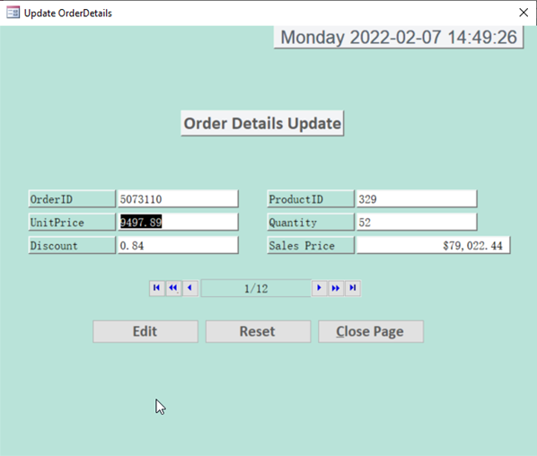
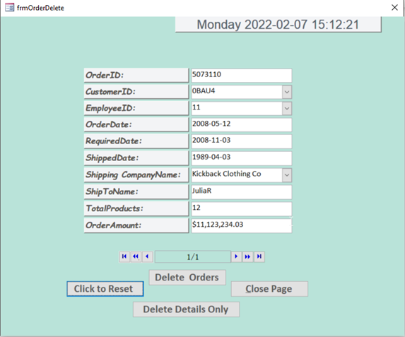
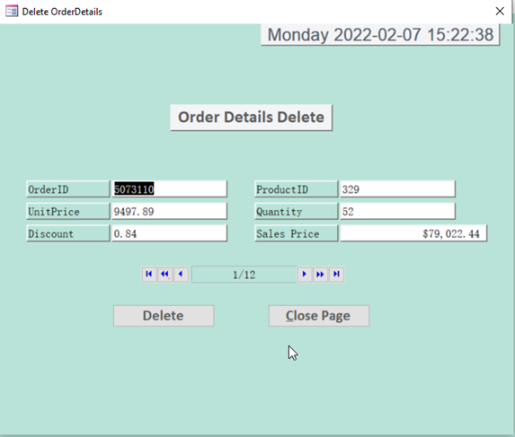

# Microsoft ACCESS

* Develop an Application using VBA
* Advanced forms to allow users query data (SELECT/DELETE/UPDATE/INSERT) without constructing any SQL queries:

1) Users send the instructions by simply pressing the buttons in the forms
2) VBA receives the instructions from the front-end forms
3) VBA constructs SQL queries and sends them to back-end database
4) Database executes the SQL queries and returns the result
5) VBA populates the result to the front-end forms for users

** **ADODB Connection** and disconnected client-side **Recordset** are the main techniques for both ends to communicate and transfer the data.

** To improve the application performance, **buffering** is introduced so that users don't need to wait before they get response from database.

** Other techiniques or tools to enhance the user experience are **Cascading Combo Boxes, Option Buttons, Listbox, Inputbox, Msgbox.**

## Requirements

* Microsoft Office or 365

## Design

* The application contains 5 management systems (Order, Customer, Employee, Product and Shipper).

  * Note: the OrderDetails Management System is integrated with Order Management System
  * 
* Every Management System contains four forms to view/delete/update/insert data in respective tables in the database.

  
* Take Order Management System as an example:

  

  

    

    

    

    

    

    
